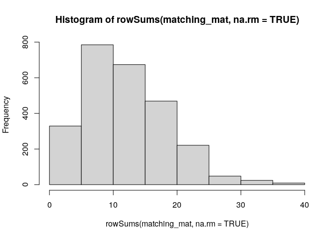

Permutation
================

# Data loading

``` r
library(data.table)

# Reading the data and identifying individuals and their first shooting event
njforce <- data.table::fread("../data-raw/njforce_200210.csv")
reports <- subset(
  njforce,
  select = c(
    date, officerid, firearm_discharged, firearm_pointed, incidentid,
    officer_male, officer_nyears, officer_race, officer_rank, town,
    officer_po, officer_sleo, nsubjects, Incident_type
    ))
reports[, date := as.Date(date, format = "%m/%d/%Y")]
```

Question: How many neighboring events within one month each event has
(+-15 days)?

``` r
incidents <- unique(subset(reports, select = c(incidentid, date, town)))
incidents <- incidents[order(town, date, decreasing = FALSE)]

matching_mat <-
  # The event happened within 15 days post or prior the event
outer(
  incidents$date,
  incidents$date, function(i,j) {
    ((i - 15) <= j) & ((i + 15) >= j)
  }
) &
  # And it happened in the same town
outer(
  incidents$town,
  incidents$town,
  "=="
)

hist(rowSums(matching_mat, na.rm = TRUE))
```

<!-- -->

What does this means? Well, it means that each individual has about 10
possible incidents to swap with other individuals. For example,
individual+event \((i,T_a)\) could be swapped with individual+event
\((j, T_b)\). The changes can be done randomly following various steps:

1.  At each iteration a random pair \((i, T_a)\) and a corresponding
    possible event+individual \((j, T_b)\) are selected

2.  The pairs are swapped so that we have \((i, T_b)\) and \((j, T_a)\).

3.  Repeat.

This can be viewed as a degree-sequence permutation algorithm in which
the row-sums and col-sums are preserved. In particular, instead of
having an \(n\times n\) adjacency matrix, we would have an affiliation
matrix of dimension
\((\text{n individuals})\times(\text{n incidents})\), so the row-sums
show the number of events each individual was par of while the col-sums
show the number of individuals per event. Furthermore, this would be a
conditional degree-sequence preserving permutation algorithm.

The inference would be computed as follows:

For b in {1 through B}:

1.  Generate a permutation (doing \(k\) steps)

2.  Calculate the vector of exposures for the permutation: \(E^{(b)}\)

3.  Compute the statistic of relevance, e.g. linear regression
    coefficient or averages.

Once we have the distribution of those statistics, we can then compare
it to the observed statistic. One example could be the regression
coefficient of the exposure parameter, or, following the network
matching literature, the coefficient associated with the increment from
\(e\) to \(e + 1\) in the exposure term.
