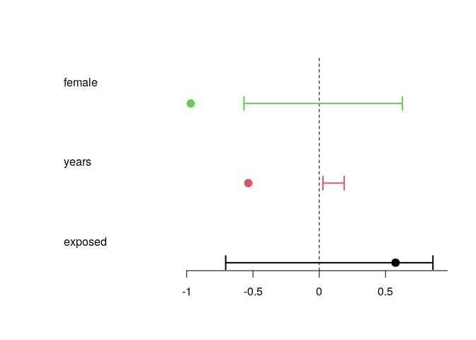

<!-- README.md is generated from README.Rmd. Please edit that file -->

# mc3logit: Matched Case-Control Conditional Logit

<!-- badges: start -->

[](https://lifecycle.r-lib.org/articles/stages.html#experimental)
<!-- badges: end -->

The `mc3logit` package implements permutation-based inference for
conditional logistic regression models. Permutation-based methods for
matched case-control logit were notably used by Ridgeway (2016).

## Installation

<!-- You can install the released version of mc3logit from [CRAN](https://CRAN.R-project.org) with: -->
<!-- ``` r -->
<!-- install.packages("mc3logit") -->
<!-- ``` -->

You can install `mc3logit` from [GitHub](https://github.com/) with:

``` r
# install.packages("devtools")
devtools::install_github("gvegayon/use_of_force", subdir = "rpackage")
```

## Example

This is a basic example which shows you how to solve a common problem:

``` r
library(mc3logit)
#> Loading required package: survival

# Simulating data
x <- sim_events(200, 300, seed = 122)

# Fitting
ans <- clogit_perm(
  nperm = 1000,
  pointed000001 ~ female + years + exposed + strata(incidentid),
  data = x
  )
```

``` r
print(ans)
#> 
#> CONDITIONAL LOGIT (WITH PERMUTATION)
#>   N events: 83
#>     N perm: 1000
#>          N: 607
#>        AIC: 94.01
#>        BIC: 101.27
#> MODEL PARAMETERS (odds):
#>  female       0.38*** [ 0.57,  1.87] < 0.01
#>   years       0.59*** [ 1.03,  1.21] < 0.01
#> exposed       1.78    [ 0.49,  2.36]   0.21
plot(ans)
```


